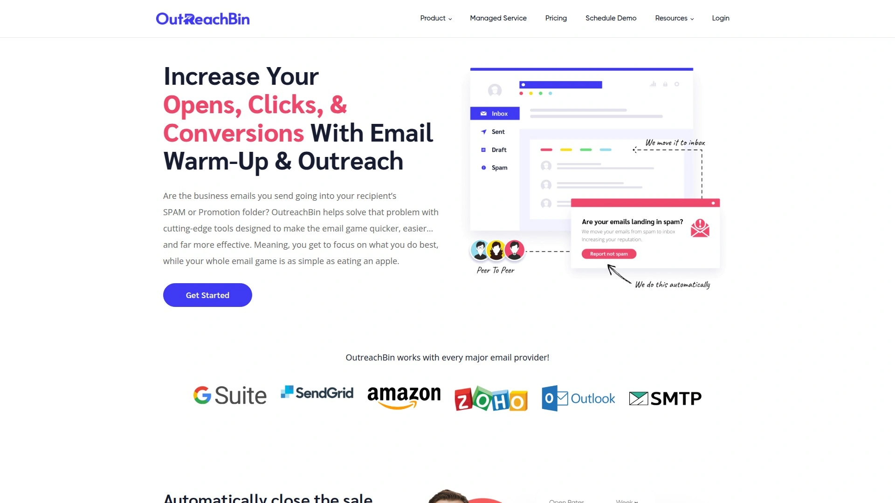

# 2025's Most Recommended 15 Free Email Deliverability Tools

Your cold emails are landing in spam folders instead of primary inboxes. Open rates are tanking. Reply rates dropped below two percent. You set up SPF, DKIM, and DMARC records perfectly, but Gmail and Outlook still treat your outreach like junk mail. The problem isn't your email content or technical setup—it's your sender reputation sitting at zero because your domain has no positive engagement history with inbox providers.

Email warmup tools solve this by simulating real human conversations between your inbox and networks of established email accounts. These tools gradually increase sending volume, generate positive engagement signals like opens and replies, and train inbox providers to trust your domain. Within two to four weeks, your deliverability jumps from fifty percent to ninety-five percent or higher, putting your emails where they belong—in front of actual humans who might respond.

***

## **[Warmy](https://www.warmy.io)**

AI-powered warmup with topic-specific conversations, perfect for high-volume senders who need aggressive scaling and multilingual outreach capabilities.

Warmy's Adeline AI dynamically adjusts warmup volume based on real-time inbox performance. The system monitors your sender health score—tracking open rates, click rates, reply rates, and Gmail-specific metrics through Google Postmaster Tools integration. If your deliverability drops, Adeline automatically reduces sending volume. When performance improves, it ramps back up.

The platform supports up to 2,000 warmup emails daily per inbox on premium plans, which is considerably higher than most competitors. This makes Warmy suitable for agencies managing dozens of domains or businesses running massive cold outreach campaigns. The system works with any mailbox using SMTP, including Gmail, Outlook, Amazon SES, Mailgun, and SendGrid.

**Multi-language warmup** sets Warmy apart from basic tools. You can configure warmup emails in multiple languages, which helps if you're targeting international markets or running campaigns across different regions. The AI generates contextually appropriate conversations in each language rather than relying on obvious translations.

The warmup process simulates realistic engagement by sending emails, opening them, replying naturally, bookmarking messages, and pulling emails out of spam folders. All interactions happen across real user inboxes within Warmy's network. The conversations use varied timing patterns—no rigid schedules that spam filters can detect.

**Sender Health Score** displays composite metrics including deliverability percentage, spam folder rate, and inbox placement across major providers. The dashboard integrates with Google Postmaster Tools for Gmail-specific insights like domain reputation and spam rate. You can track performance trends over time and identify exactly when deliverability issues started.

Setup takes about five minutes. Connect your inbox via SMTP or OAuth, configure daily sending limits and reply rates, then activate warmup. The system handles everything automatically from that point forward. Pricing starts at $49 monthly for the Starter plan with roughly 100 warmup emails daily. Business plans run $129 monthly for around 300 daily warmups. Premium hits $189 monthly for 1,000 daily warmups. Platinum tops out at $279 monthly supporting up to 2,000 daily warmups.

Seven-day free trial available. No credit card required upfront. The platform lacks API access for bulk domain management, which becomes problematic when you're handling fifty-plus domains. Initial setup can confuse users new to warmup tools—the interface assumes you understand concepts like reply rate optimization and sending volume calculations.

---

## **[MailReach](https://www.mailreach.co)**

Built for B2B outreach with real Google Workspace and Office 365 inboxes, ideal for sales teams who treat deliverability seriously and need placement accuracy.

MailReach's warmup network consists of 30,000-plus real business-grade inboxes—not throwaway SMTP accounts. This matters because positive engagement from Google Workspace and Office 365 addresses carries more weight with Gmail and Outlook spam filters. The network maintains an average reputation score above 95, ensuring your warmup interactions actually improve sender reputation.

The **machine learning warmup engine** varies send time, subject lines, and reply formats using human-like patterns. No two warmup emails look identical. This avoids the obvious automation footprints that modern spam filters detect. The system gradually increases volume from five to ten emails daily up to a maximum of 100 warmup emails per day.

**Live inbox placement testing** runs actual tests to diverse inboxes under real sending conditions. Instead of arbitrary spam scores like Mail-Tester, MailReach shows exactly where your email lands—primary inbox, promotions tab, or spam folder—across Gmail, Outlook, Yahoo, and other providers. The test reveals specific reasons why emails miss the inbox, such as broken authentication records or content triggers.

Monitoring alerts notify you when sender reputation drops by domain. Teams managing multiple inboxes can track deliverability per domain and get proactive warnings before campaign performance tanks. The domain-level insights help identify which specific mailboxes need attention.

**Spam test tool** scans email content for triggers like risky phrases, excessive capitalization, or suspicious links. The tool comes with 20 credits per inbox. Additional credits cost extra. DNS authentication checks detect missing or broken SPF, DKIM, and DMARC records. Blacklist monitoring scans public lists to catch reputation issues early.

Pricing starts at $25 monthly per inbox. That's mid-range compared to competitors but justified by the high-quality warmup network. The platform supports Gmail, Google Workspace, Office 365, Outlook, Zoho, Yahoo, Exchange, and any SMTP/IMAP provider. Setup takes about ten minutes—connect via SMTP credentials or OAuth, configure warmup settings, activate the process.

MailReach offers **API access** for managing warmup at scale. This helps agencies or platforms handling hundreds of domains. The API lets you automate warmup activation, adjust settings programmatically, and pull deliverability data into your own systems.

The warmup network quality justifies the higher price point. Unlike tools with networks crowded by custom SMTP mailboxes—which provide zero deliverability benefit—MailReach's Google and Microsoft inbox network actually moves the needle on sender reputation. For serious B2B cold outreach, this distinction matters more than saving ten bucks monthly.

---

## **[Instantly](https://instantly.ai)**

Unlimited warmup for unlimited accounts with massive user network, best for scaling cold outreach across dozens of email addresses simultaneously.

Instantly's warmup pool includes up to one million users who also enabled the warmup feature. Your emails exchange with thousands of other Instantly customers who open messages and respond with positive sentiment. The algorithm generates contextually relevant conversations—not random gibberish—so interactions appear natural to inbox providers.

The system operates three warmup tiers based on account quality. **Basic pool** (orange flame) contains mostly SMTP accounts with minimal Google or Outlook support, serving as the downgrade tier when users exceed SMTP limits. **Standard pool** (green flame) provides balanced Google, Outlook, and SMTP accounts for solid deliverability. All new accounts default here. **Premium pool** (blue flame) consists exclusively of aged Google and Microsoft accounts with stricter quality controls. Accounts in premium pool receive nine percent more replies compared to standard warmup.

Premium pool costs $500 monthly but includes all Done-For-You accounts at no extra charge. For most users, standard pool delivers consistent results without the premium price tag. The warmup system warms up both SMTP sending servers and IMAP servers simultaneously when you connect a sending account.

Setup is fully automated. Connect email accounts to Instantly, enable warmup via toggle switch, and the system runs transparently in the background. No manual monitoring required. No complex workflows. The warmup mimics human behavior to ensure deliverability signals sent to inbox providers appear authentic.

**Multi-tier pool system** prevents abuse while maintaining quality. Users who violate fair usage policies or exceed SMTP limits get moved to basic pool, keeping standard and premium pools clean. This quality control ensures everyone in standard and premium tiers benefits from strong warmup network reputation.

Limitations exist. Instantly's warmup pool currently supports Google and Outlook accounts only. No Yahoo, Zoho, or custom SMTP providers. The platform lacks granular deliverability diagnostics like DNS analysis or engagement modeling. For advanced deliverability troubleshooting, you'll need supplementary tools. But for straightforward warmup that scales effortlessly across many accounts, Instantly delivers consistent results.

Pricing includes warmup as part of Instantly's cold email platform. Plans start around $30 monthly for basic outreach features. Higher tiers unlock more sending accounts and advanced automation. The unlimited warmup across unlimited accounts makes Instantly cost-effective when you're managing five-plus domains.

The warmup runs continuously as long as accounts remain connected. You can adjust settings like daily send volume and reply rate through the warmup dashboard. Real-time engagement tracking shows how warmup emails perform—open rates, reply rates, spam folder placement. This data helps identify accounts that need adjustment.

***

## **[TrulyInbox](https://www.trulyinbox.com)**

Affordable entry point with unlimited inboxes on paid plans, suitable for agencies managing client accounts or businesses with multiple domains.

TrulyInbox uses AI-generated content to create human-like conversations with high-reputation email accounts. The system gradually increases sending volume while maintaining natural engagement patterns—opens, replies, marking as important, and removing from spam. All interactions happen within TrulyInbox's warmup pool of established inboxes.

The platform supports seven major email service providers: Gmail/Gsuite, Office 365, Outlook.com/Hotmail/Live, Yahoo Mail, Zoho, GoDaddy, and Yandex. Setup takes under five minutes. Add your email account, configure preferred warmup settings like daily send volume and reply rate, then activate the process. TrulyInbox handles the rest automatically.

**Inbox placement tracking** provides analytics on where warmup emails land—inbox, promotions tab, or spam folder. The reporting is minimal but functional. You get basic metrics showing deliverability trends and spam rates. Not as detailed as MailReach or Warmy, but adequate for monitoring progress.

Pricing is straightforward and affordable. **Free plan** includes 10 warmup emails daily with up to 10 percent reply rate. Starter plan costs $29 monthly for 100 daily warmups and 25 percent reply rate. Growth plan runs $79 monthly supporting 1,000 daily warmups with 45 percent reply rate. Scale plan hits $189 monthly for 3,000 daily warmups and 60 percent reply rate. Business plan tops out at $289 monthly with 6,000 daily warmups, 65 percent reply rate, premium support, team access, and API.

The key advantage here is **unlimited inboxes** on paid plans. Unlike competitors charging per inbox, TrulyInbox lets you warm up as many email accounts as needed for one monthly fee. This makes the platform extremely cost-effective for agencies juggling dozens of client domains or businesses running multiple brands.

API access on Business plan enables automation for larger operations. You can programmatically activate warmup, adjust settings, and pull deliverability data. The API documentation is basic but covers essential use cases.

TrulyInbox lacks advanced features found in premium tools. No DNS health checks. No blacklist monitoring. No sophisticated deliverability diagnostics. The platform focuses purely on warmup fundamentals—sending emails, generating engagement, improving sender reputation. For many users, this simplicity is a feature rather than limitation.

G2 rating sits at 3.1 stars, which is lower than top competitors. Some reviewers mention deliverability improvements taking longer than expected. Others praise the unlimited inbox model and responsive customer support. The platform works best for budget-conscious users who need basic warmup across many accounts.

***

## **[InboxAlly](https://www.inboxally.com)**

Custom recipient accounts with real human engagement, perfect for email marketers and list owners who need proven deliverability fixes fast.

InboxAlly uses a fundamentally different approach than automated warmup tools. The platform employs real people with established email addresses who manually engage with your emails. These recipients open your messages, click links, mark emails as important, and reply naturally. This human-driven engagement teaches inbox providers that your emails are valued by recipients.

The service works by having you add InboxAlly's recipient addresses to your email list. When you send broadcasts, those recipients interact with your emails in ways that signal trust to Gmail, Yahoo, Outlook, and other providers. Over time—typically one to two weeks—your sender reputation improves dramatically. Open rates often jump from thirty percent to seventy percent or higher.

**Real-time engagement tracking** shows exactly when InboxAlly recipients interact with your emails. You can monitor progress as messages move out of spam folders into primary inboxes. The platform provides comprehensive deliverability reports breaking down inbox placement across major providers.

InboxAlly targets specific use cases. **Mailing list owners** struggling with deliverability despite following best practices. **Cold outreach teams** whose messages consistently hit spam. **Agencies** managing client email campaigns who need reliable inbox placement. **Email service providers** trying to prevent customer churn due to deliverability issues. **Deliverability consultants** who need another tool for clients with stubborn engagement problems.

The platform offers a **free email tester** that generates detailed spam score reports. The tool analyzes content, structure, and sender reputation, providing actionable insights to improve deliverability before launching campaigns.

Pricing starts at $149 monthly for one inbox. That's significantly higher than automated warmup tools. But you're paying for real human engagement rather than bot interactions. The higher cost reflects the labor-intensive nature of manual engagement. For businesses where email drives substantial revenue, the investment often pays for itself through improved open rates and conversions.

InboxAlly works best when paired with proper list hygiene and email authentication. The service doesn't fix fundamental issues like sending to purchased lists or using broken DNS records. But when technical setup is solid and you need engagement signals to rebuild reputation, InboxAlly delivers results competitors can't match.

Customer testimonials consistently mention escaping "Gmail spam jail" within two weeks. One agency owner reported improving client open rates from thirty percent to seventy-plus percent. A freelance email marketer with eight years experience calls InboxAlly their go-to deliverability solution. An eighteen-year business owner resolved major deliverability issues after migrating email platforms.

Setup requires adding InboxAlly's recipient addresses to your email list or CRM. The platform provides detailed onboarding instructions. Customer support is highly responsive—most inquiries get answered within hours. The team provides deliverability tips and troubleshooting help beyond basic technical support.

***

## **[Warmbox](https://www.warmbox.ai)**

Private network of 35,000 inboxes with GPT-4 content generation, ideal for users who want plug-and-play warmup with extensive geographic diversity.

Warmbox's network spans 35,000-plus private inboxes from over 100 countries, aged from two weeks to fifteen years. This geographic and age diversity creates natural-looking engagement patterns that avoid spam filter detection. The system initiates conversations between your inbox and thousands of others from different email service providers.

The platform uses **GPT-4 and Hybrid content generation** to create realistic email templates. Warmbox sends emails from your inbox that look like genuine human communication—varied subject lines, natural body text, realistic replies. The AI ensures no two warmup emails appear identical, preventing pattern recognition by spam filters.

Warmbox automatically performs key engagement actions: removing emails from spam folders, opening and bookmarking messages, replying to portions of emails, and generating positive interactions. These actions directly improve your email sending reputation with inbox providers.

**Four warmup recipes** with smart rules and customizable settings let you tailor the process to your needs. You can edit warmup timing ranges to match your working hours and timezone, adjust daily email volume, configure reply rates, and fine-tune all parameters flexibly. The system recommends optimal settings automatically, but advanced users can access expert-level controls.

The platform connects inboxes from any email provider in seconds—Gmail, Gsuite OAuth, Outlook 365, Yahoo Mail, Amazon SES, SMTP, and others. No technical skills required. Fast and easy setup that takes under two minutes.

**Dedicated inbox dashboard** provides detailed reports and analytics. You can monitor warmup progress, track key metrics like deliverability percentage and spam folder rate, and fine-tune strategy based on performance data. The reporting interface makes it easy to identify which accounts need attention.

Domain settings inspection checks authentication and protection against spoofing and malicious activities. The tool verifies SPF, DKIM, and DMARC records, alerting you to configuration issues that harm deliverability.

Pricing starts at $15 monthly for the Solo plan supporting one inbox warmup. That's among the most affordable options available. Plans scale up based on number of inboxes and daily warmup volume. The platform offers a free trial so you can test functionality before committing.

Warmbox lacks advanced features like API access or detailed deliverability diagnostics. The daily email limit caps at 50 emails per inbox on basic plans, which is lower than premium competitors. For users with modest warmup needs and tight budgets, Warmbox delivers solid value. But high-volume senders or users requiring sophisticated controls should consider more robust platforms.

***

## **[Lemwarm](https://lemwarm.com)**

Integrated with Lemlist for free, great for existing Lemlist users who want seamless warmup without additional subscriptions.

Lemwarm connects to Lemlist's cold email platform, providing free warmup for Lemlist subscribers. The tool interacts with over 10,000 real users who have established domain reputations. Unlike bots or fake addresses, these real accounts generate authentic engagement signals that improve your sender score.

The system simulates **human-like conversations** by varying content, timing, and interaction patterns. Warmup emails include realistic subject lines and body text generated using AI guided by expert copywriters. The messages look like genuine business communication rather than obvious automation.

**Industry-specific clustering** places your email in groups based on your audience, goals, and sector. This targeted approach enhances sender reputation within your specific niche, increasing chances of reaching primary inboxes rather than promotions tabs.

Lemwarm automatically generates a personalized warmup plan, gradually ramping up email volume until messages consistently reach inboxes. You can track progress through the deliverability dashboard and determine optimal timing to start regular campaigns. The dashboard shows factors affecting deliverability, monitors sender reputation, tracks blacklisting issues, and provides actionable tips for maintaining high scores.

**Technical setup requirements** must be completed before activating Lemwarm. You need proper email authentication including SPF (verifies emails sent from your domain), DKIM (ensures emails aren't altered after sending), DMARC (protects domain from phishing), MX Records (identifies servers accepting emails for your domain), and Custom Tracking Domain (enables open and click rate tracking). Lemwarm includes a technical setup checker to verify configuration.

Pricing for standalone Lemwarm (without Lemlist) starts at $24 monthly for one email account. Additional accounts cost extra. For Lemlist users, warmup is included free with their subscription, making it a no-brainer add-on. The platform supports Gmail, Google Workspace, Outlook, Office 365, Yahoo, and other major providers.

Setup takes about ten minutes. Connect your email account, configure warmup settings like daily volume and reply rate, and activate the process. Lemwarm recommends warming up existing accounts for at least two weeks. New domains need one to two months of warmup before launching cold campaigns.

The deliverability dashboard provides sender reputation scores, placement rates across providers, and alerts when issues arise. You can monitor multiple accounts from one interface, making it convenient for users managing several domains.

Lemwarm works best when paired with Lemlist's cold outreach features. The integration means warmup data informs campaign strategy—you can see exactly which accounts are ready for outreach and which need more warmup time. For standalone warmup without Lemlist, other tools offer more features at similar price points.

***

## **[Mailivery](https://mailivery.io)**

Peer-to-peer network with unlimited inboxes at flat rate, suitable for agencies and SaaS platforms needing high-volume warmup with API access.

Mailivery uses AI to interact with real emails behind the scenes in your inbox. The algorithm removes emails from spam folders and generates positive replies to improve deliverability in real time. Unlike most services, Mailivery connects to a peer-to-peer network of 30,000-plus real Mailivery users with genuine email addresses—not throwaway accounts.

**Comprehensive reporting** shows exactly how many emails land in spam versus inbox. Real-time analytics track sender reputation improvements over time. The dashboard breaks down deliverability by email provider, helping identify specific issues with Gmail, Outlook, Yahoo, or others.

**Blacklist monitoring** checks seventy-plus blacklists to see if your domains or IPs are listed. You get immediate alerts when reputation issues arise, allowing prompt action before deliverability tanks. This proactive monitoring prevents campaigns from failing due to undetected blacklisting.

Mailivery lets you **customize volume and timing** of warmup emails. Set daily limits that match your outreach patterns to ensure maximum deliverability without triggering spam filters. The flexible scheduling adapts to different timezone requirements and sending patterns.

All interactions happen **behind the scenes in dedicated folders**, so warmup activity doesn't interfere with actual sales and marketing work. You won't see warmup emails cluttering your inbox or mixing with real prospect communications. The system keeps everything organized automatically.

**Team features** support agencies and larger organizations. Invite teammates, assign roles, and monitor each inbox's warmup activity from one dashboard. For platforms and high-volume teams, Mailivery offers custom solutions with elevated limits, full API access, and an embeddable web form to streamline client onboarding.

The API enables programmatic warmup management for SaaS platforms or agencies handling hundreds of domains. You can automate account activation, adjust settings in bulk, and pull deliverability data into your own reporting systems. This level of integration helps scale operations without manual overhead.

Pricing starts at $29 monthly but the standout feature is **unlimited inboxes** for one flat rate. Most competitors charge per inbox, so costs escalate quickly when managing multiple domains. Mailivery's pricing model makes it extremely cost-effective for agencies or businesses with five-plus email accounts.

The peer-to-peer network model means you're not just receiving engagement from Mailivery's system—you're also interacting with other customers' email accounts. The more diverse email addresses engaging with yours, the stronger the reputation signal. This network effect amplifies deliverability improvements.

Mailivery works with Gmail, Google Workspace, Outlook, Office 365, and other major providers. Setup takes about ten minutes—connect accounts via SMTP or OAuth, configure warmup parameters, activate the system. The platform runs continuously in the background once enabled.

***

## **[Snov.io](https://snov.io)**

All-in-one sales platform with free warmup on basic plan, perfect for users who want email verification and lead generation alongside deliverability tools.

Snov.io integrates email warmup into its broader sales automation platform. The warmup tool creates authentic email history and positive engagement for your accounts automatically. During warmup campaigns, your email automatically sends and receives messages from other users' accounts and system mailboxes, guaranteeing optimal results through authentic activity.

**Two warmup strategies** address different needs. **Progressive warmup** starts with low email volume and gradually increases daily until hitting your goal. Best for new accounts building reputation from scratch. **Steady warmup** sends consistent email volume daily to stabilize reputation through predictable sending patterns. Ideal for accounts with existing history that need maintenance.

The platform uses **AI-powered content generation** to craft unique, human-like email copy. The AI creates realistic same-thread conversations that appear natural to spam filters. This hyper-intelligent content generation ensures warmup emails don't trigger automation detection.

Snov.io supports accounts from any email provider and can perform **targeted warmup** focused on specific templates. This template-specific warmup creates positive engagement history for the exact email copy you'll use in campaigns, improving inbox placement for actual outreach.

**Free to try and scalable** pricing makes Snov.io accessible. The Trial plan includes one warmup slot with 15 daily email limit. Starter plan provides three slots with 50 daily limit. Pro plans offer unlimited warmup slots—Pro S allows 100 daily emails per account, Pro M supports 200 daily, Pro L handles 500 daily, and Ultra tops out at 1,000 daily emails per account.

The daily limit per account means you can warm up unlimited mailboxes simultaneously on Pro plans, but each individual account has its own sending cap. This structure works well for agencies managing many client domains without needing massive volume per account.

**Integrated deliverability monitoring** tracks progress through the warmup dashboard. You focus on the Deliverability metric—once it reaches ninety percent or higher and you've hit your daily sending goal, warmup is complete. The dashboard provides clear visibility into which accounts are ready for campaigns.

Snov.io's broader feature set includes email verification, drip campaigns, email finder tools, lead generation databases, and CRM functionality. If you need warmup plus other sales tools, Snov.io consolidates everything into one platform. For users who only need warmup, standalone tools might offer better value.

Setup takes under ten minutes total. Pick email accounts to warm up, choose providers to focus on, set reply rate around thirty percent to avoid spam triggers, select Progressive or Steady strategy, add AI-powered content or custom templates, then launch. The system runs automatically from that point forward.

Important limitation: **Email warmup service not provided for Google accounts** due to Google's API policy changes banning automated warmup. Snov.io works with Outlook, Yahoo, Zoho, and other providers but cannot warm up Gmail or Google Workspace addresses.

***

## **[Folderly](https://folderly.com)**

Comprehensive deliverability platform with daily monitoring and expert support, ideal for businesses serious about maintaining ninety-nine percent inbox placement.

Folderly goes beyond basic warmup to provide full-spectrum deliverability solutions. The platform warms up domains, mailboxes, IPs, and email templates simultaneously through automated processes paired with daily monitoring and AI insights. This multi-layered approach addresses deliverability from every angle.

**Daily inbox monitoring** shows exactly where emails land across major providers. Folderly's AI-powered system tracks placement rates in real time, helping you understand outbound performance and optimize warmup efforts. The monitoring catches deliverability drops immediately rather than discovering problems weeks later after campaigns fail.

**Spam trigger detection** identifies why emails land in spam folders. The platform analyzes both technical issues (authentication records, IP reputation, DNS configuration) and content-based problems (spam words, formatting, link quality) in Gmail and Outlook. You get specific explanations for deliverability issues rather than vague scores.

The **spam words checker** detects and flags language that harms email delivery. Removing these trigger words improves sender reputation and supports higher inbox placement. The tool integrates expert-backed deliverability techniques and best practices directly into the platform, providing actionable guidance for improvement.

**Automated placement testing** lets you choose a mailbox and email template to start precise testing. You receive detailed reports on where emails land across major providers—primary inbox, promotions tab, or spam folder. This data-driven approach eliminates guesswork from deliverability optimization.

**IP insights** provide overview of sending IPs including type, sender score, and blacklist information. Domain health monitoring offers in-depth analysis of technical issues with step-by-step resolution guides. This combination of IP and domain monitoring ensures both infrastructure components maintain strong reputation.

Folderly actively monitors **blocklist operators** so you can react quickly when issues arise, minimizing campaign impact. The platform conducts continual spam trap monitoring and analyzes spam trap volume to identify areas affecting reputation. Avoiding spam traps is critical for maintaining deliverability—Folderly catches these issues before they cause serious damage.

**Certified compliance** with SOC 2 and ISO27001 standards ensures data security. Real-time alerts notify you the second an email lands in spam, with actionable tips to safeguard future campaigns. Tailored expert support provides campaign assistance customized to your exact needs.

The platform integrates via API and SMTP with major email service providers including Gmail, Outlook, Office 365, Amazon SES, Mailgun, SendGrid, and supports custom providers. This flexibility works for businesses using any infrastructure.

Pricing starts at $120 monthly for the Basic plan. Professional plans range from $500 to custom enterprise pricing. That's significantly more expensive than simple warmup tools, but Folderly provides comprehensive deliverability management beyond warmup. For businesses where email drives substantial revenue, the investment often pays for itself.

Customer reviews consistently mention achieving ninety-nine percent deliverability within weeks. One user reported sorting a problematic mailbox in two weeks, though another account took six months due to poor historical sending practices. The Folderly support team remained patient and helpful throughout, providing tips to improve delivery rates.

***

## **[Smartlead](https://www.smartlead.ai)**

Unlimited auto-rotating mailboxes with AI-powered warmup, best for scaling cold outreach with robust inbox rotation and centralized management.

Smartlead's warmup system automatically adds your email account to their warmup pool when you enable the feature. Your mailbox exchanges warmup emails with other Smartlead users' inboxes. The sophisticated AI simulates real user behavior—sending, opening, saving from spam, and replying to emails. By mimicking genuine activity, Smartlead builds positive reputation for your account.

**Custom warmup identifier tags** inject directly into email body, ensuring messages aren't flagged as spam by providers. The email appears as regular human communication rather than automated warmup. You set these tags in warmup settings, making it easy to identify and filter warmup emails from your actual campaigns.

Smartlead provides **self-adjusting warmup infrastructure** that ramps up once inbox providers trust you. The AI opens emails, clicks links, and replies at varied times mimicking real users. Content and timing shuffle constantly to block pattern detection by spam filters. You maintain full control over how many inbound warmup emails receive replies.

**Real-time inbox health monitoring** pauses invalid or deleted inboxes automatically, keeping the warmup pool clean. This quality control prevents your warmup from being compromised by dead accounts. A single dashboard lets you track sends, replies, and reputation climb across all connected mailboxes.

The platform supports Gmail, Outlook, and SMTP mailboxes. You simply toggle "Enable Warmup," pick daily send caps and reply rates, then let the AI handle pacing. Warmup runs continuously in the background without interfering with actual campaigns. Warmup emails don't consume your daily sending limits set for regular outreach.

**Unlimited warmup across unlimited mailboxes** makes Smartlead cost-effective for high-volume operations. Most competitors charge per inbox—costs explode when managing twenty-plus domains. Smartlead's flat-rate pricing includes warmup regardless of how many accounts you connect.

Recommended warmup duration is two weeks minimum for existing accounts. New domains need one to two months of warmup before launching cold campaigns. The warmup dashboard shows deliverability metrics, helping you determine when accounts are ready for outreach.

**Email verifier integration** reduces bounce rates by cleaning contact lists before sending. Invalid addresses inflate bounce rates and tank sender reputation. Smartlead's verifier identifies bad emails proactively. The platform also includes blacklist monitoring, inbox rotation for campaign scalability, and Smartbot AI for managing replies in the centralized master inbox.

Pricing includes warmup as part of Smartlead's cold outreach platform. Plans start with a fourteen-day free trial. Basic plans run around $40 monthly. Higher tiers unlock more features like white-labeling for agencies, advanced analytics, and priority support. The unlimited warmup makes Smartlead particularly attractive for agencies and businesses managing multiple brands.

Twenty-four-seven customer support provides live chat assistance. The help center contains comprehensive guides for warming up emails, setting up campaigns, and troubleshooting deliverability issues. For technical users, Smartlead offers API access for programmatic account management.

Some users report warmup generating excessive "Undeliverable" notifications, which potentially hurts deliverability rather than helping. The warmup pool quality varies—effectiveness depends on having high-reputation accounts in the network. Premium pool upgrades improve results but cost extra.

***

## **[Warmup Inbox](https://www.warmupinbox.com)**

Language-specific warmup with natural conversations, suitable for international businesses targeting multiple regions with localized email campaigns.

Warmup Inbox offers **language-specific warmup** as a core differentiator. You can configure warmup emails in multiple languages, ensuring conversations appear natural to recipients in different regions. This matters for businesses running international outreach where English-only warmup emails would seem out of place.

The platform simulates engagement by sending, opening, and replying to emails across real user inboxes. Warmup messages get marked as important and removed from spam folders, generating positive signals to inbox providers. All interactions happen within Warmup Inbox's network of established email accounts.

**GPT-generated templates** during warmup ensure content looks human-written rather than obviously automated. The AI varies subject lines, body text, and reply patterns so no two emails appear identical. This content diversity prevents spam filters from detecting repetitive patterns.

The system supports major email providers including Gmail, Google Workspace, Outlook, Office 365, Yahoo, and others. Setup is straightforward—connect your inbox via SMTP or OAuth, configure daily send volume and reply rate, then activate warmup. The process runs automatically in the background.

Pricing starts at $15 monthly for basic warmup supporting one email account. That's among the most affordable options available. The platform offers a seven-day free trial so you can test functionality before committing. Higher-tier plans support more inboxes and increased daily sending volume.

**User-friendly interface** saves time during setup and monitoring. The dashboard provides quick access to key metrics like deliverability percentage, spam folder rate, and engagement levels. You can adjust warmup settings on the fly without complex configuration.

Warmup Inbox lacks some advanced features found in premium platforms. No DNS health checks. No blacklist monitoring. No API access for automation. The daily warmup limit caps at fifty emails per day on basic plans, which is lower than competitors. For users needing sophisticated diagnostics or high-volume warmup, this becomes limiting.

The platform works best for small to medium businesses with modest warmup requirements. If you're warming up a handful of accounts for moderate-volume outreach, Warmup Inbox delivers solid value at a budget-friendly price. The language-specific warmup genuinely helps businesses targeting international markets.

***

## **[OutreachBin](https://outreachbin.com)**

Cold email platform with integrated InboxWarm, great for users who want outreach automation and warmup in one affordable package.

OutreachBin combines cold email automation with email warmup through their InboxWarm tool. The platform builds reputation through peer-to-peer network interactions, moving spam emails to inbox and replying automatically to improve sender score. This dual functionality makes OutreachBin suitable for users who need both warmup and outreach capabilities.

**InboxWarm** sends warmup emails to OutreachBin's peer-to-peer network of real email addresses. When warmup emails land in spam, the system moves them to inbox automatically. These positive interactions signal to inbox providers that your emails are legitimate, helping increase sender reputation and ensure inbox delivery.

The warmup process writes, sends, schedules, and replies to emails automatically while generating **human-like email activity**. The system varies sending patterns to mimic real person behavior rather than obvious automation. This natural activity pattern helps avoid spam filter detection.

**Cold email builder** with automated follow-up sequences lets you create ongoing or one-time campaigns. Advanced personalization features upload variables that mix and match copy, making every email appear uniquely crafted. This hyper-personalization improves engagement and deliverability.

OutreachBin's **email deliverability setup assistant** guides you through proper configuration of authentication records and technical requirements. This built-in help reduces errors during setup that could harm deliverability.

The platform offers advanced scheduling, throttling controls, and A/B testing. Prospects view tracks engagement across your entire outreach. Advanced analytics show campaign performance including open rates, reply rates, and conversion metrics. These insights help optimize both warmup and outreach strategies.

**Unique pricing structure** charges based on number of email accounts rather than monthly subscription tiers. You must purchase minimum three months upfront. One email account for three months costs $39.90 monthly. Annual billing reduces the rate to $19.97 monthly per account. All features are included regardless of plan level.

This pricing model works well for users with stable account needs who can commit to quarterly or annual terms. It becomes expensive if you need month-to-month flexibility or frequently change the number of accounts.

**User reviews are largely negative** due to the company discontinuing lifetime deals that early customers purchased. Many buyers feel betrayed by this decision, leading to poor ratings and community backlash. Separate from that controversy, the platform's functionality works adequately for basic warmup and outreach needs.

OutreachBin supports connection to various email providers including Gmail, Outlook, and SMTP. The interface is accessible for beginners without extensive email marketing experience. However, the platform lacks some advanced features found in specialized tools—no sophisticated deliverability diagnostics, limited analytics compared to enterprise solutions.

For budget-conscious users who want basic warmup plus cold email automation, OutreachBin delivers reasonable value despite the negative sentiment around business practices. The peer-to-peer warmup network functions similarly to other tools at this price point.

***

## **[EmailWarmup](https://emailwarmup.com)**

Free warmup service with AI-powered conversations, perfect for startups and small businesses testing email outreach without budget commitment.

EmailWarmup operates as a completely free warmup service—no credit card required, no hidden costs, no trial period expiration. The platform provides AI-powered warmup that mirrors your actual campaigns and sequences in real time, creating hyper-personalized warmup that matches your sending style.

The system uses **AI engines powered by Claude Opus and GPT-5**, supervised by expert copywriters who understand human communication patterns. Prompt engineers guide the AI using natural language processing to generate realistic warmup conversations. This sophisticated content generation ensures warmup emails appear genuinely human-written.

**Free deliverability testing** runs unlimited tests forever. Other platforms charge $25 to $85 monthly for basic testing. EmailWarmup provides comprehensive testing at no cost, with coverage across fifty-plus mailbox providers including regional ones. You get detailed breakdowns of where emails land without worrying about credit limits or surprise bills.

The testing network includes both major providers (Gmail, Outlook, Yahoo) and regional services used in specific markets. This broad coverage helps businesses targeting international audiences understand deliverability across different regions. The platform shows exact placement—inbox, promotions, spam—for each provider tested.

EmailWarmup studies your actual email campaigns and sequences, then **mirrors them perfectly** during warmup. Your warmup activity matches your real sending style, looks natural, and uses hyper-personalization. This matching approach helps achieve inboxing rates as high as ninety-eight percent on Pro accounts. The platform backs this claim with a full refund guarantee.

**Setup takes minutes**. Connect your email account, configure warmup settings, and activate the process. The system runs automatically in the background. You can monitor progress through the dashboard showing deliverability trends, engagement rates, and placement statistics.

The completely free model makes EmailWarmup accessible to anyone testing cold email outreach. Startups can validate their email strategy without upfront investment. Small businesses get professional-grade warmup at zero cost. Individual freelancers can warm up personal domains for client work.

Limitations exist compared to premium platforms. No dedicated support team. No API access. No advanced features like blacklist monitoring or DNS health checks. The free model means the platform generates revenue elsewhere—potentially through data aggregation or future premium upgrades. But for basic warmup, EmailWarmup delivers genuine value at an unbeatable price point.

***

## **[WarmInbox](https://workspace.google.com/marketplace/app/warminbox_email_warmup_for_gmail_deliver/900209538863)**

Gmail-specific warmup through Google Workspace Marketplace, ideal for Gmail users who want native integration without third-party connections.

WarmInbox installs directly from Google Workspace Marketplace as an official Gmail add-on. This native integration means setup uses Google's authentication rather than sharing SMTP credentials with third parties. The security advantage matters for businesses with strict data policies.

The tool simulates real email activity—opens, clicks, replies, and thread engagement—to build trusted sender reputation. WarmInbox runs automatically in the background every business day, warming up your account with natural-looking interactions from a trusted network of inboxes. The activity patterns mimic how real people use email throughout the workday.

**Smart inbox rotation** uses diverse real inboxes to mimic natural email behavior. The system varies which accounts interact with yours, preventing obvious patterns that spam filters detect. This rotation ensures engagement signals appear authentic to Gmail's algorithms.

**Google App Password support** provides simple, secure integration with Gmail accounts. You don't need to compromise account security or violate corporate policies to use the warmup. The setup follows Google's recommended authentication methods.

**Live dashboard** tracks warmup progress, sender score, and inbox placement statistics. You can monitor deliverability improvements over time and identify when your account is ready for outreach campaigns. The reporting focuses specifically on Gmail and Google Workspace performance since that's the platform's specialty.

WarmInbox targets specific users: email marketers running Gmail campaigns, SaaS founders using Google Workspace for outbound, sales teams on Gmail, agencies managing client Google accounts, and anyone launching cold emails or newsletters from Gmail. The tool addresses both new domain warmup and fixing existing deliverability issues.

Pricing follows Google Workspace Marketplace standards. The basic plan is affordable for individual users. Higher tiers support multiple accounts and increased warmup volume. Exact pricing requires checking the Marketplace listing as it varies by region and Google's billing structure.

The Gmail-specific focus is both strength and limitation. If you only use Gmail, WarmInbox provides optimized performance for that ecosystem. But if you manage multiple email providers—Outlook, Yahoo, custom SMTP—you'll need additional tools. WarmInbox won't warm up non-Gmail accounts.

The Google Workspace integration adds legitimacy. Being listed in the official Marketplace means Google reviewed and approved the tool. This vetting process provides confidence that WarmInbox follows platform policies and won't compromise account security.

For Gmail users, WarmInbox offers streamlined warmup without juggling multiple platforms. The native integration, Google authentication, and Gmail-optimized algorithms make it a natural choice for businesses already invested in Google's ecosystem.

***

## How long does email warmup take before I can start cold outreach?

New email accounts need minimum two weeks of warmup before launching cold campaigns. Brand new domains require one to two months because they have zero sending history with inbox providers. During warmup, gradually increase daily sending volume from five to ten emails up to your target amount—never exceed fifty emails daily for new accounts. Monitor deliverability metrics until you consistently hit ninety percent or higher inbox placement. At that point, your domain has sufficient reputation to handle cold outreach without immediately triggering spam filters. Keep warmup running continuously even after starting campaigns—the ongoing positive engagement offsets negative signals from cold emails that recipients ignore or mark as spam.

## Can warmup tools fix deliverability if I'm already in spam folders?

Warmup helps rebuild damaged sender reputation, but it's not magic. If you're currently in spam due to authentication issues—broken SPF, DKIM, or DMARC records—fix those technical problems first. Warmup can't override fundamental configuration errors. If spam placement stems from poor sending practices like blasting huge lists without segmentation, warmup provides breathing room to reset your reputation while you improve email quality. The process typically takes three to six weeks for damaged domains versus two weeks for new accounts. During recovery, reduce outreach volume to let warmup dominate your sending activity. The positive engagement signals gradually convince inbox providers to trust your domain again.

## Do I need separate warmup for each email account or just the domain?

Warmup each individual email account separately. While domain reputation matters, inbox providers also track mailbox-level metrics. Two addresses on the same domain can have drastically different deliverability if one sends high-quality emails while the other blasts spam. When you connect multiple accounts to a warmup tool, each one participates in the warmup network independently—sending, receiving, and engaging with different users. This individual warmup builds reputation for that specific mailbox. If you rotate between multiple accounts for outreach, warm them all simultaneously so each address maintains strong sender score when it's their turn to send campaigns.

---

## Final Thoughts

Cold emails hitting spam folders kill your pipeline before prospects ever see your message. Authentication records and technical setup matter, but sender reputation drives whether Gmail and Outlook actually deliver your emails. [Warmy](https://www.warmy.io) handles this through AI that adapts warmup volume based on real-time performance, supports aggressive scaling up to 2,000 daily warmup emails for high-volume operations, and includes multilingual warmup for international campaigns. The Adeline AI monitors your sender health continuously and adjusts automatically when deliverability drops, so you're not manually tweaking settings every time inbox placement fluctuates.
